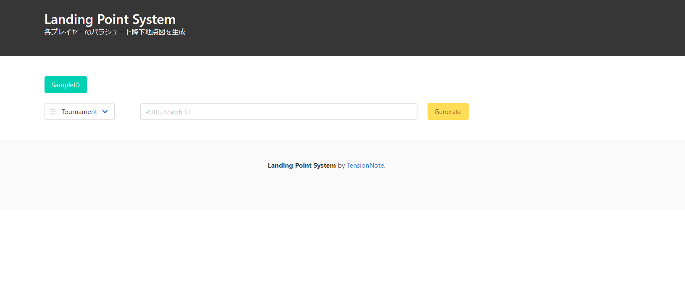
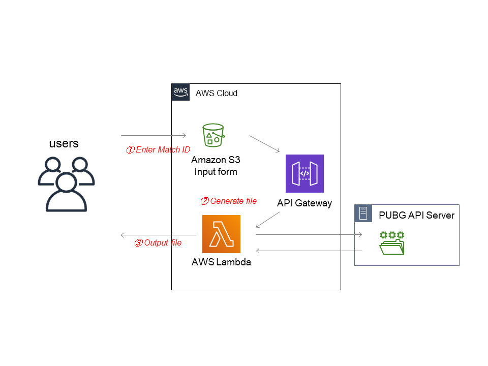

# Landing Point System
# 概要
 PUBG APIからマッチデータを取得し、各プレイヤーの初期降下地点図を自動生成するシステム

# 背景
 PUBGのプロリーグでは、各チームの降下地点などを調査することが、戦略決定において重要な要素となります。 
 そのためアナリスト達は毎日の練習試合の結果を確認し、それぞれのチーム動向について注視しておく必要です。 
 しかしながら、選手への提供資料は手作業で作成しているため 
 - 作業量が多いため、アナリストへの負荷が大きく選手への情報フィードバックが遅れがち
 - アナリストごとに資料品質のばらつきが発生すること
 といった問題が発生していました。

# システムの目的
 他サイトにて取得できるマッチID（PUBGの1試合ごとのデータごとに割り当てられるID）を本システムを入力することで 
 PUBG APIサーバからデータを自動で取得し、各チームの降下地点図を自動生成します 
 これによって作業負荷の軽減・資料品質の向上を達成を目指しました

# 使用技術
- Python 3.8.3
- AWS
  - S3
  - Lambda
  - API Gateway
- PUBG API
- Discord API

# システム画面
 

# AWS構成図
 

